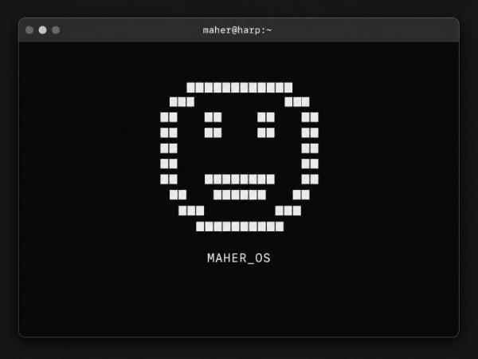

<div align="center">

# `MAHER_OS`

### `CS ∩ Math ⊕ Neuroₑ꜀`

**Wanna-Be Researcher / Builder**


<a href="https://maherharp.github.io">
  
</a>

<br>

<sub>interactive terminal portfolio · built because a normal README was boring</sub>

</div>

<br>

<div align="center">
  <a href="https://maherharp.github.io">
    
  </a>
</div>


<br>

```text
┌──────────────────────────────────────────────────────────────┐
│                                                              │
│  MAHER_OS                                                    │
│                                                              │
│  [BOOT] mathematical reasoning ................. OK          │
│  [BOOT] machine learning stack ................. OK          │
│  [BOOT] research environment ................... OK          │
│  [BOOT] curiosity .............................. ENABLED     │
│  [BOOT] side quest engine ...................... ENABLED     │
│  [BOOT] sleep schedule ......................... DEGRADED    │
│                                                              │
│  System initialized.                                         │
│                                                              │
│  maher@harp:~$ ./figure_it_out.sh                            │
│                                                              │
│  → INTERACTIVE TERMINAL AVAILABLE                            │
│                                                              │
└──────────────────────────────────────────────────────────────┘
```

<div align="center">

## [`> ENTER INTERACTIVE MODE`](https://maherharp.github.io)

<sub>type <code>help</code> after boot</sub>

</div>

---

## `MAHER_OS // SAFE MODE`

```text
GitHub does not allow executable shell access inside README.md.

Static environment loaded.

For full functionality:

maher@harp:~$ ./launch_interactive
```

<div align="center">

### [`LAUNCH MAHER_OS →`](https://maherharp.github.io)

</div>

```text
INTERACTIVE MODE FEATURES
────────────────────────────────────────────────────────────

✓ command execution
✓ live public GitHub repositories
✓ command history
✓ tab autocomplete
✓ customizable terminal themes
✓ coursework explorer
✓ research archive
✓ bookshelf
✓ side quests
✓ hidden commands
✓ questionable life decisions
```

---

## `$ whoami`

```text
Maher Harp

Harvard University

Concentration:
Computer Science ∩ Mathematics

Secondary:
Neuroscience

Wanna-Be Researcher / Builder

CURRENT DIRECTIVE
> Build things that let me sleep at night knowing I matter.
```

---

## `$ connect`

<div align="center">

<a href="https://github.com/MaherHarp">
  
</a>

<a href="https://www.linkedin.com/in/maherharp/">
  
</a>

<a href="mailto:maherharp@college.harvard.edu">
  
</a>

<a href="https://x.com/maheraharp">
  
</a>

<a href="https://www.instagram.com/maheraharp/">
  
</a>

</div>

---

<div align="center">

```text
maher@harp:~$ exit

Connection to README.md closed.

if you've made it this far,
we should probably build something.

EOF
```

### [`./figure_it_out.sh`](https://maherharp.github.io)

</div>
